<!--
---
page_type: sample
languages:
- python
products:
- fabric
- fabric-database-cosmos-db
- power-bi
name: |
   Translytical Task Flows
urlFragment: translytical-taskflows
description: Build end-to-end translytical workflows combining Cosmos DB in Fabric, User Data Functions, and Power BI for real-time data updates from interactive reports.
---
-->

# 🔄 Translytical Task Flows with Cosmos DB in Microsoft Fabric

## Build end-to-end translytical workflows combining operational and analytical workloads

This tutorial walks you through building an end-to-end translytical task flow that utilizes Cosmos DB in Microsoft Fabric as the data store. Learn how operational and analytical workloads can work together seamlessly using User Data Functions and Power BI.

> **Note:** Translytical task flows are currently in public preview.

## 🎯 What You'll Learn

### **📊 Translytical Concepts**

- **Real-time data write-back** from Power BI reports back to Cosmos DB
- **User Data Functions** for executing business logic from visualizations
- **Interactive data workflows** combining analytics and operations

## 📋 Prerequisites

### Required Services

- **Microsoft Fabric workspace** with appropriate permissions (or [start a free Fabric trial](https://learn.microsoft.com/fabric/get-started/fabric-trial))
- **Cosmos DB item** in Fabric with sample data loaded
- **[Power BI Desktop](https://powerbi.microsoft.com/desktop/)** with the [required preview features enabled](https://learn.microsoft.com/en-us/power-bi/create-reports/translytical-task-flow-overview)

## 🏗️ Solution Architecture

A translytical task flow combines three key components:

| Component | Purpose | Technology |
| --------- | ------- | ---------- |
| **Operational Data Store** | Real-time access to operational data for analytics | Cosmos DB in Fabric |
| **Data Logic Layer** | Execute business logic when triggered such as writing back to the data store | User Data Functions |
| **Visualization Layer** | Display data and provide interactive controls | Power BI |

## 🚀 Getting Started

### Step 1: Create a Cosmos DB Database in Microsoft Fabric

This sample utilizes the sample data provided in the Cosmos DB database in Microsoft Fabric.

1. Create a new workspace in Microsoft Fabric. Follow the  steps outlined in [Create a workspace](https://learn.microsoft.com/en-us/fabric/fundamentals/create-workspaces).

1. Follow the steps outlined at [Create a Cosmos DB database in Microsoft Fabric](https://learn.microsoft.com/en-us/fabric/database/cosmos-db/quickstart-portal). The steps involve creating a new Cosmos DB database in your Fabric workspace and loading sample data into it.

    > **Note:** Ensure that you load the sample data into your Cosmos DB database as described in the tutorial, we'll be using that data later in the tutorial.

1. Take note of the database name and container name you create, as you'll need them later.

### Step 2: Build and Publish a User Data Function

Next, we'll create a user data function that updates the current price of a product in the Cosmos DB database.

1. In your Fabric workspace, select **+ New Item** from the top-right corner then select **User Data Function** in the Develop data section.

    

1. Provide a name for your User Data Function, e.g., `update_price_writeback`.

1. On the User Data Function editor page, select **New function**.

    

1. Replace the default code in the editor with the following code snippet.

    ```python
    import fabric.functions as fn
    udf = fn.UserDataFunctions()

    import logging
    from datetime import datetime
    from typing import Any
    from azure.cosmos import CosmosClient
    from azure.cosmos import exceptions

    COSMOS_URI = "YOUR_COSMOS_DB_URI_HERE"
    DB_NAME = "YOUR_DATABASE_NAME_HERE"
    CONTAINER_NAME = "SampleData"

    @udf.connection(argName="cosmosClient", audienceType="CosmosDB", cosmos_endpoint=COSMOS_URI)
    @udf.function()
    def update_product(cosmosClient: CosmosClient, categoryName: str, productId: str, newPrice: float) -> list[dict[str, Any]]:

        try:
            # Get the database and container clients
            database = cosmosClient.get_database_client(DB_NAME)
            container = database.get_container_client(CONTAINER_NAME)

            # Get the current product document
            product = container.read_item(item=productId, partition_key=categoryName)

            # Update the product's price
            product["currentPrice"] = newPrice
            
            now = datetime.now().replace(microsecond=0)
            current_time_iso = now.isoformat()
            
            # Append to the price history
            product["priceHistory"].append({
                "date": current_time_iso,
                "price": newPrice
            })

            # Replace the document in the container
            container.replace_item(item=productId, body=product)

            return product

        except exceptions.CosmosResourceNotFoundError as e:
            logging.error(f"Item not found in update_product: {e}")
            raise
        except exceptions.CosmosHttpResponseError as e:
            logging.error(f"Cosmos error in update_product: {e}")
            raise  
        except exceptions as e:
            logging.error(f"Unexpected error in update_product: {e}")
            raise
    ```

1. Replace `YOUR_COSMOS_DB_URI_HERE` with the URI of your Cosmos DB database. You can find this in the **Settings** > **Connection** section of your Cosmos DB database in Fabric.

    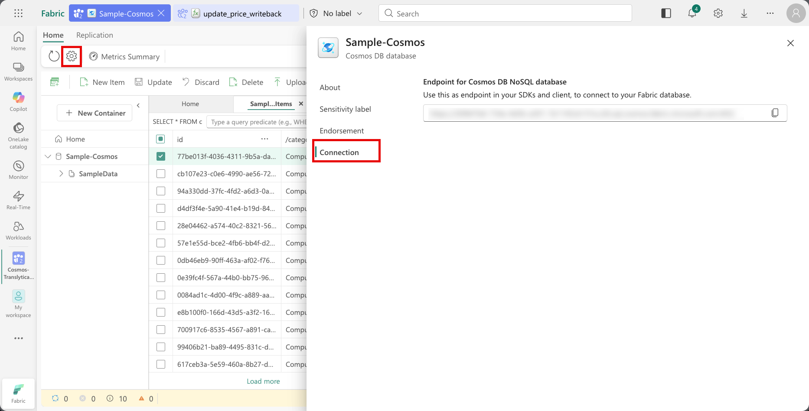

1. Replace `YOUR_DATABASE_NAME_HERE` with the name of the Cosmos DB database that you created earlier.

1. On the top menu bar, select **Publish** to publish your user data function.

    

1. Once the function is published, hover over the function name in the left pane and select the **Test** icon.

    

1. In the test pane, provide sample input values for `categoryName`, `productId`, and `newPrice`. For example:

    - `categoryName`: Computers, Desktops
    - `productId`: 05bca58f-257c-4129-8373-1b0951cb8104
    - `newPrice`: 5000

1. Select the **Test** button to execute the function. Review the output and logs to ensure the function executed successfully then close the test pane.

### Step 3: Connect & Transform Data in Power BI

Finally, we'll create a Power BI report that allows users to update product prices and see the changes reflected in real-time.

1. From the Power BI Desktop, create a new report.

1. Connect to your Cosmos DB database in Fabric by selecting **Get Data** > **More** then search for **Cosmos DB** and select **Azure Cosmos DB v2** connector and select **Connect**.

    

1. In the connection dialog, provide the Cosmos DB Endpoint and for **Data Connectivity mode**, select **DirectQuery**. Select **OK**.

    If prompted for authentication, select **Organizational account** and sign in with your Microsoft Fabric credentials and select **Connect**.

    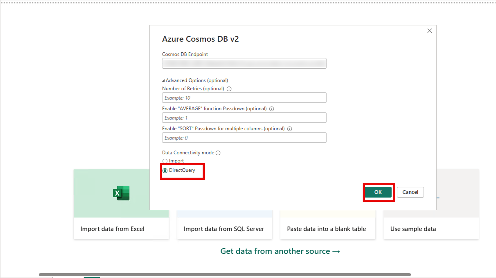

1. In the Navigator pane, expand the Cosmos DB database and select the two containers: `SampleData` and `SampleData_PriceHistory[]`. 

    Select **Transform Data** to open the Power Query Editor.

    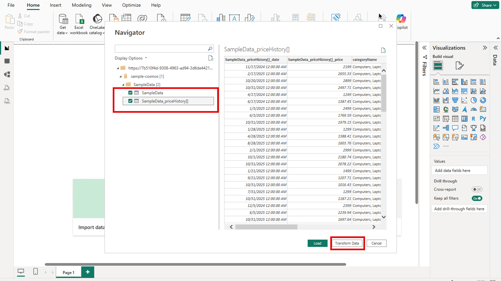

1. In the Power Query Editor, rename **SampleData_priceHistory[]** to **PriceHistory** for easier reference.

1. Select the **SampleData** table and keep the following columns only: `categoryName`, `currentPrice`, `description`, `docType`, `name` and `productId`. Do this by selecting these columns, right-clicking, and choosing **Remove Other Columns**.

1. Select the **docType** column, in the **SampleData** table, then filter to only include rows where `docType` is equal to `product`.

1. Select the **PriceHistory** table and remove the following columns: `SampleData(categoryName)`, `SampleData(id)`.

1. Rename the columns `SampleData_priceHistory[]_date` and `SampleData_priceHistory[]_price` to `date` and `price` respectively.

1. Close and apply the changes to load the data into Power BI.

    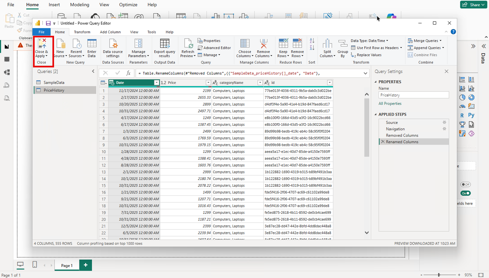

### Step 4: Create Interactive Report in Power BI

In this section, build visuals with the data that you loaded into your Power BI report and connect the user data function to enable price updates.

1. Switch to the **Model** view in Power BI Desktop, and select **Manage Relationships** from the top menu.

    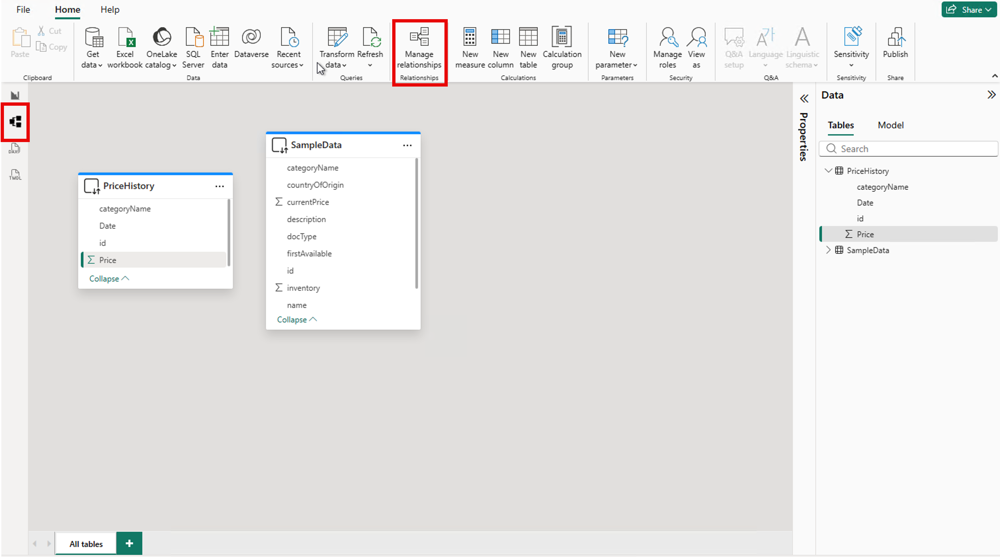

1. In the Manage Relationships dialog, select **New Relationship** and in the New Relationship dialog, create a relationship between the `productId` field in the `SampleData` table and the `id` field in the `PriceHistory` table. Select **Save** to create the relationship.

    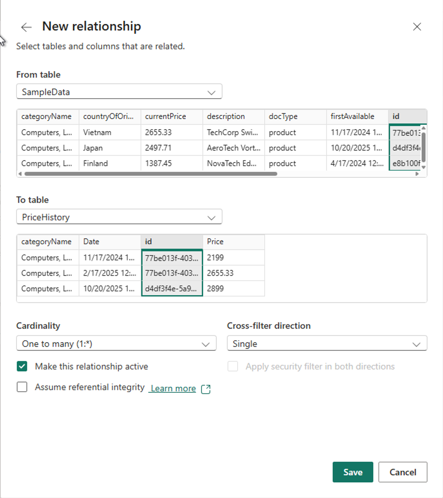

1. Close the Manage Relationships dialog and switch back to the **Report** view.

1. In the **Visualizations** pane, select the **Slicer** visual to add it to the report canvas, and from the **Data** pane, select the `categoryName` field from the `PriceHistory` table.

    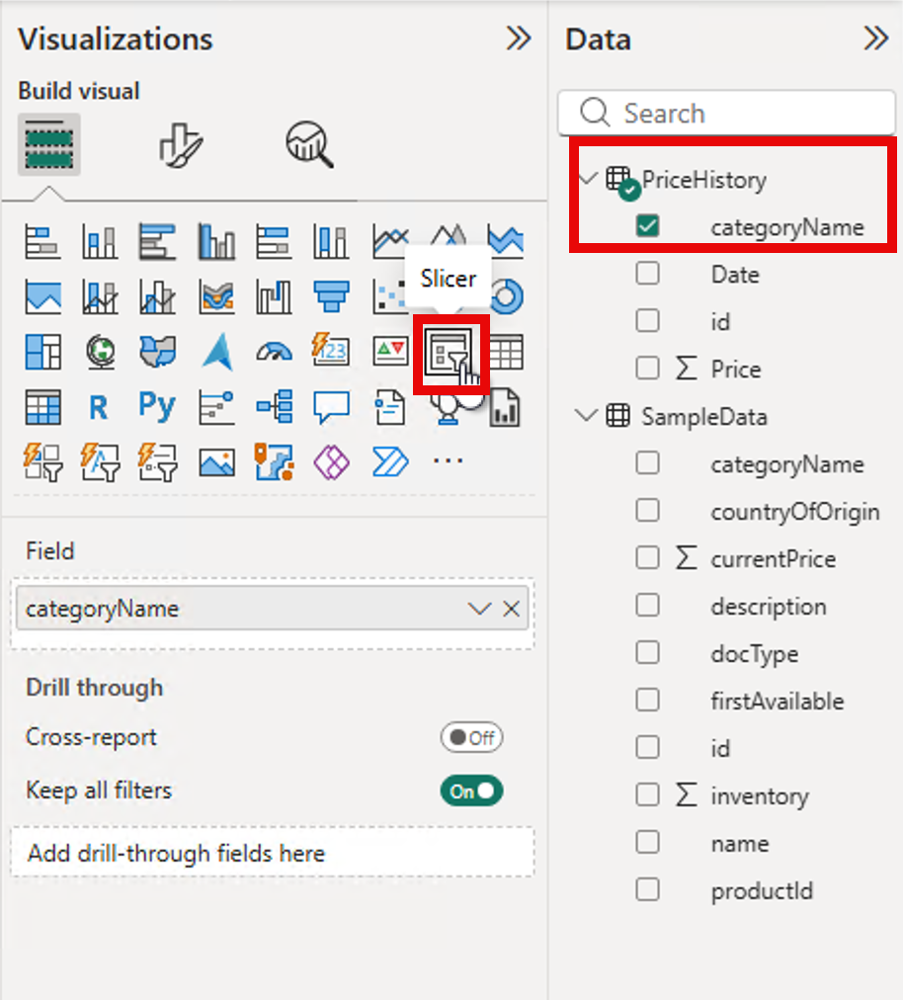

1. Select the **Format Visual** tab in the Visualizations pane, in the **Slicer Settings** section, change the **Style** to **Dropdown**.

    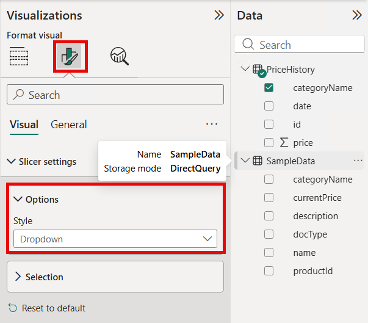

1. Using the same steps, add another slicer visual for the `name` field from the `SampleData` table. This slicer will allow users to select a specific product.

1. Add a **Card** visual to the report canvas and drag the `currentPrice` field from the `SampleData` table to **Value** well and change the Summarization to **Sum**.

    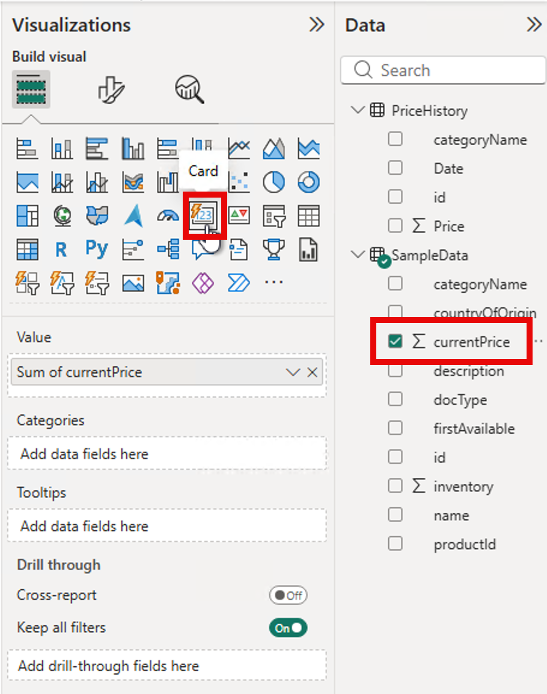

1. In the **Format Visual** tab, in the **Visual** tab, expand the **Callout** section and toggle off **Label**.

1. In the **Format Visual** tab, select the **General** tab. Toggle on **Title**, expand the **Title** section and set the title text to `Current Price`.

1. Add a **Line Chart** visual to the report canvas. From the **Data** pane, drag the `Date` field from the `PriceHistory` table to the **X axis** well, and the `Price` field to the **Y axis** well.

    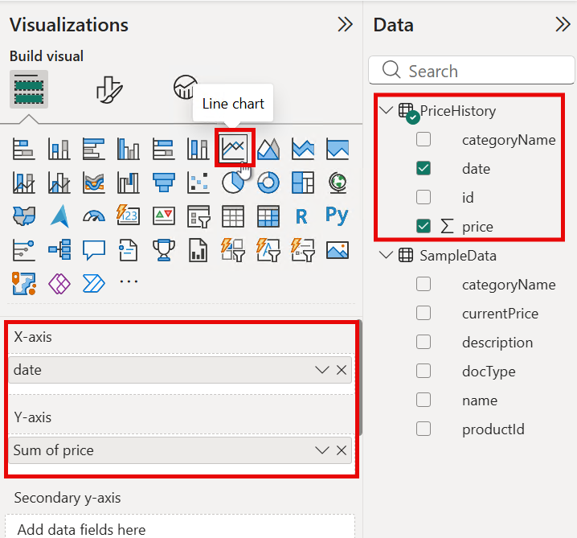

1. Add a **Text Slicer** visual to the report canvas.

    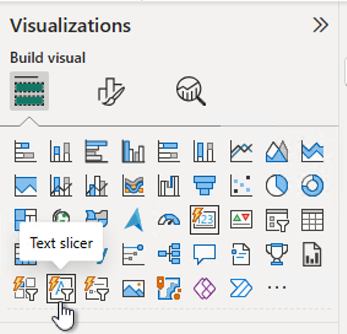

1. Select the text slicer and use the **Format visual > General > Title** options to give the text slicer the following title: `Enter New Price`.

    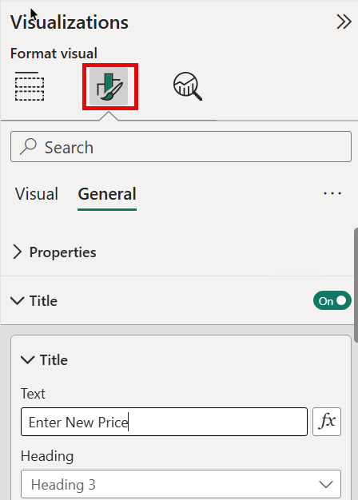

1. On the taskbar, select the Insert menu and add a Blank button to the report. Drag the button under the text slicer.

    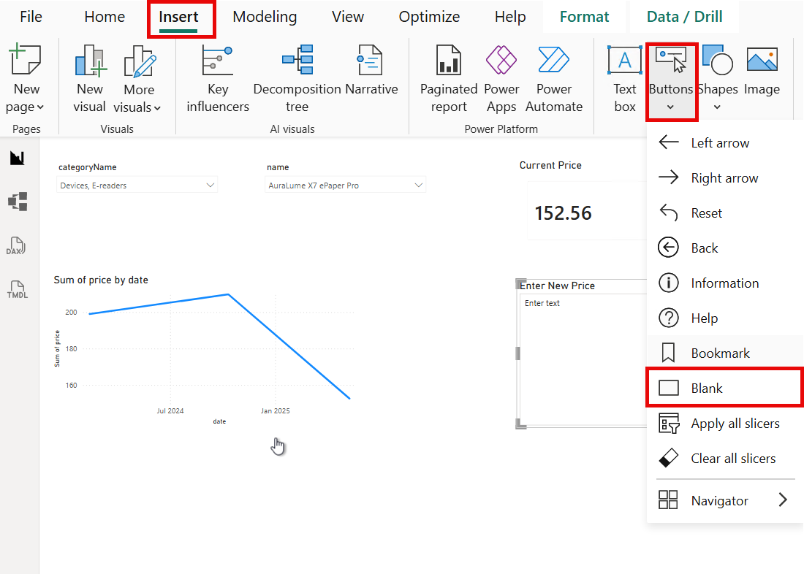

1. Select the button and expand the Action options in the **Format button** pane. Turn the Action radio button to On.

1. Expand the **Action** section and provide the following values for your button:

    - **Type**: Data function
    - **Data function**: Select the **fx** button to open the data function selection pane and expand the `update_price_writeback` User data functions and select the `update_product` function. Select **Connect**.

1. Still in the **Action** section, map the function parameters to the appropriate fields and controls in your report:

    - **categoryName**: Select the **fx** button  and in the Data function dialog under *What field show we base this on?*, select the `categoryName` field from the `PriceHistory` table.
    - **productId**: Repeat the previous step and select the `productId` field from the `SampleData` table.
    - **newPrice**: Select `Enter New Price` from the dropdown.

    

1. Select the button and expand the **Style** options in the **Format button** pane. Turn the **Text** radio button to On and set the button text to `Submit`.

1. In the **Style** > **Apply settings to**, switch the **State** option to **Loading**. The loading state is a unique state available to data function buttons that you can use to define style options that appear while the data function is running.

1. Expand the **Text** section and replace the button text value with `Submitting`.

1. Your final report should look similar to the following:

    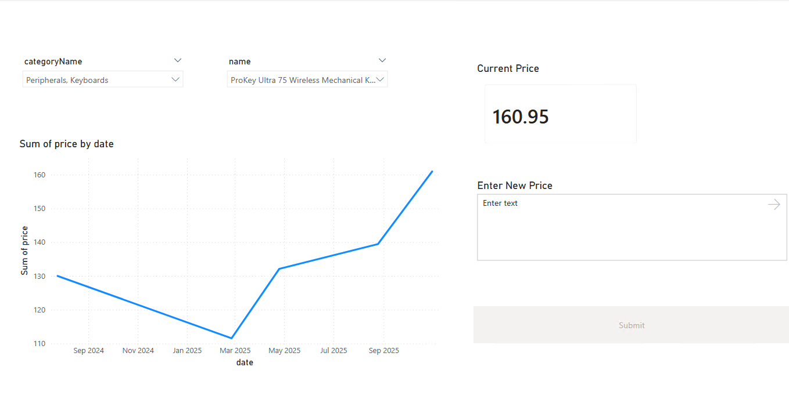

### Step 5: Publish and run the translytical Task Flow

1. Save your Power BI report and select **Publish** from the Home tab to publish the report to your Fabric workspace.

1. Navigate to your Fabric workspace and open the published report.

    > **Note:** On opening the report for the first time, you may encounter an error saying, *The data source Extension is missing credentials and cannot be accessed*. Resolve this by following the following steps:
    > 1. Open the semantic model for your report and navigate to **File** > **Settings**.
    > 1. Expand the **Data source credentials** setting if it isn't already.
    > 1. Select **Edit credentials**.
    > 1. Choose **OAuth2** as your **Authentication method** from the dropdown menu.
    > 1. select **Sign in** and sign in with your Microsoft Fabric credentials.

1. In the text slicer, enter a new price for the selected product.

1. Click the Submit button to invoke the user data function and update the product price in Cosmos DB.

1. After the function completes, select the **Refresh** button and notice that the current price and price history visuals update to reflect the new price.

## 📚 Additional Resources

- [Cosmos DB in Fabric Documentation](https://docs.microsoft.com/fabric/database/cosmos-db/overview)
- [User Data Functions Documentation](https://learn.microsoft.com/fabric/data-engineering/user-data-functions/user-data-functions-overview)
- [Translytical Task Flows Documentation](https://learn.microsoft.com/en-us/power-bi/create-reports/translytical-task-flow-overview)
